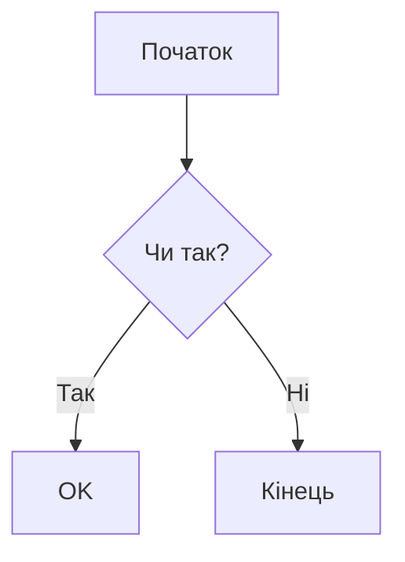

# Посібник з Markdown

## Зміст
- [Базовий синтаксис](#базовий-синтаксис)
- [Форматування тексту](#форматування-тексту)
- [Списки](#списки)
- [Посилання та зображення](#посилання-та-зображення)
- [Блоки коду](#блоки-коду)
- [Таблиці](#таблиці)
- [Цитати](#цитати)
- [Горизонтальні лінії](#горизонтальні-лінії)
- [Списки завдань](#списки-завдань)
- [Виноски](#виноски)
- [Емодзі](#емодзі)
- [Розширені можливості](#розширені-можливості)

## Базовий синтаксис

### Заголовки
```markdown
# Заголовок H1
## Заголовок H2
### Заголовок H3
#### Заголовок H4
##### Заголовок H5
###### Заголовок H6
```

### Параграфи
```markdown
Це параграф. Він відокремлений від інших параграфів порожніми рядками.

Це інший параграф.
```

## Форматування тексту

### Наголос
```markdown
*Курсивний текст* або _Курсивний текст_
**Жирний текст** або __Жирний текст__
***Жирний курсив*** або ___Жирний курсив___
~~Закреслений текст~~
```

### Вбудований код
```markdown
Використовуйте `код` у вашому тексті
```

## Списки

### Марковані списки
```markdown
- Елемент 1
- Елемент 2
  - Піделемент 2.1
  - Піделемент 2.2
- Елемент 3

* Альтернативний маркер
* Інший елемент
```

### Нумеровані списки
```markdown
1. Перший елемент
2. Другий елемент
   1. Піделемент 2.1
   2. Піделемент 2.2
3. Третій елемент
```

## Посилання та зображення

### Посилання
```markdown
[Текст посилання](https://www.example.com)
[Посилання з заголовком](https://www.example.com "Текст заголовку")
[Посилання-посилання][reference]

[reference]: https://www.example.com
```

### Зображення
```markdown


![Посилання на зображення][image-ref]

[image-ref]: image.jpg
```

## Блоки коду

### Блоки коду з роздільниками
````markdown
```javascript
function hello() {
    console.log("Hello, world!");
}
```
````

### Підсвічування синтаксису
````markdown
```python
def hello():
    print("Hello, world!")
```
````

### Вбудований код
```markdown
Використовуйте `код` у вашому тексті
```

## Таблиці

### Базова таблиця
```markdown
| Заголовок 1 | Заголовок 2 | Заголовок 3 |
|-------------|-------------|-------------|
| Комірка 1   | Комірка 2   | Комірка 3   |
| Комірка 4   | Комірка 5   | Комірка 6   |
```

### Вирівняна таблиця
```markdown
| Вирівняно вліво | Вирівняно по центру | Вирівняно вправо |
|:----------------|:-------------------:|-----------------:|
| Вліво           | По центру           | Вправо           |
```

## Цитати

### Базова цитата
```markdown
> Це цитата
> Вона може займати кілька рядків
```

### Вкладені цитати
```markdown
> Перший рівень
>> Другий рівень
>>> Третій рівень
```

## Горизонтальні лінії
```markdown
---
***
___
```

## Списки завдань
```markdown
- [x] Виконане завдання
- [ ] Незавершене завдання
- [ ] Інше завдання
```

## Виноски
```markdown
Ось речення з виноскою. [^1]

[^1]: Це виноска.
```

## Емодзі
```markdown
:smile: :heart: :thumbsup:
```

## Розширені можливості

### Списки визначень
```markdown
Термін 1
: Визначення 1

Термін 2
: Визначення 2a
: Визначення 2b
```

### Екранування символів
```markdown
\* Зірочка
\` Зворотний апостроф
\# Решітка
```

### HTML у Markdown
```markdown
<div style="color: blue;">
  Це HTML у Markdown
</div>
```

### Математичні формули (якщо підтримуються)
```markdown
Вбудована формула: $E = mc^2$

Блок формули:
$$
\frac{n!}{k!(n-k)!} = \binom{n}{k}
$$
```

### Діаграми (якщо підтримуються)
````markdown

````

## Найкращі практики

1. **Узгодженість**: Використовуйте послідовне форматування у всьому документі
2. **Відступи**: Додавайте порожні рядки між розділами для кращої читабельності
3. **Списки**: Використовуйте правильні відступи для вкладених списків
4. **Посилання**: Використовуйте посилання-посилання для кращої підтримки
5. **Зображення**: Завжди включайте альтернативний текст для доступності
6. **Код**: Вказуйте мову для підсвічування синтаксису
7. **Таблиці**: Вирівнюйте стовпці для кращої читабельності
8. **Заголовки**: Використовуйте правильну ієрархію (не пропускайте рівні)

## Поради та хитрощі

- Використовуйте `<!-- коментар -->` для HTML-коментарів у Markdown
- Використовуйте `&nbsp;` для неразривних пробілів
- Використовуйте `&copy;` для спеціальних символів
- Використовуйте `[TOC]` для автоматичного змісту (якщо підтримується)
- Використовуйте `---` для розриву сторінки (якщо підтримується)

## Поширені проблеми та їх вирішення

1. **Списки не відображаються правильно**
   - Переконайтеся у правильних відступах перед елементами списку
   - Використовуйте послідовні маркери

2. **Блоки коду не форматується**
   - Перевірте правильність розміщення зворотних апострофів
   - Переконайтеся у правильному вказанні мови

3. **Таблиці не вирівнюються**
   - Перевірте правильність розміщення символів вертикальної риски
   - Перевірте синтаксис вирівнювання у рядку заголовка

4. **Зображення не відображаються**
   - Перевірте правильність шляху до зображення
   - Перевірте правильність синтаксису

## Додаткові ресурси

- [Посібник з Markdown](https://www.markdownguide.org/)
- [GitHub Flavored Markdown](https://github.github.com/gfm/)
- [CommonMark](https://commonmark.org/)
- [Шпаргалка з Markdown](https://github.com/adam-p/markdown-here/wiki/Markdown-Cheatsheet) 