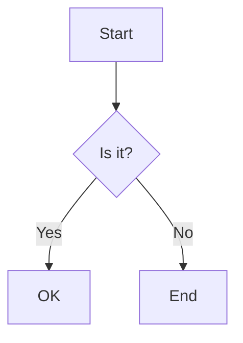

# Markdown Guide

## Table of Contents
- [Basic Syntax](#basic-syntax)
- [Text Formatting](#text-formatting)
- [Lists](#lists)
- [Links and Images](#links-and-images)
- [Code Blocks](#code-blocks)
- [Tables](#tables)
- [Blockquotes](#blockquotes)
- [Horizontal Rules](#horizontal-rules)
- [Task Lists](#task-lists)
- [Footnotes](#footnotes)
- [Emoji](#emoji)
- [Advanced Features](#advanced-features)

## Basic Syntax

### Headers
```markdown
# H1 Header
## H2 Header
### H3 Header
#### H4 Header
##### H5 Header
###### H6 Header
```

### Paragraphs
```markdown
This is a paragraph. It's separated from other paragraphs by blank lines.

This is another paragraph.
```

## Text Formatting

### Emphasis
```markdown
*Italic text* or _Italic text_
**Bold text** or __Bold text__
***Bold and italic*** or ___Bold and italic___
~~Strikethrough~~
```

### Inline Code
```markdown
Use `code` in your text
```

## Lists

### Unordered Lists
```markdown
- Item 1
- Item 2
  - Subitem 2.1
  - Subitem 2.2
- Item 3

* Alternative bullet
* Another item
```

### Ordered Lists
```markdown
1. First item
2. Second item
   1. Subitem 2.1
   2. Subitem 2.2
3. Third item
```

## Links and Images

### Links
```markdown
[Link text](https://www.example.com)
[Link with title](https://www.example.com "Title text")
[Reference link][reference]

[reference]: https://www.example.com
```

### Images
```markdown


![Reference image][image-ref]

[image-ref]: image.jpg
```

## Code Blocks

### Fenced Code Blocks
````markdown
```javascript
function hello() {
    console.log("Hello, world!");
}
```
````

### Syntax Highlighting
````markdown
```python
def hello():
    print("Hello, world!")
```
````

### Inline Code
```markdown
Use `code` in your text
```

## Tables

### Basic Table
```markdown
| Header 1 | Header 2 | Header 3 |
|----------|----------|----------|
| Cell 1   | Cell 2   | Cell 3   |
| Cell 4   | Cell 5   | Cell 6   |
```

### Aligned Table
```markdown
| Left-aligned | Center-aligned | Right-aligned |
|:-------------|:--------------:|--------------:|
| Left         | Center         | Right         |
```

## Blockquotes

### Basic Blockquote
```markdown
> This is a blockquote
> It can span multiple lines
```

### Nested Blockquotes
```markdown
> First level
>> Second level
>>> Third level
```

## Horizontal Rules
```markdown
---
***
___
```

## Task Lists
```markdown
- [x] Completed task
- [ ] Pending task
- [ ] Another task
```

## Footnotes
```markdown
Here's a sentence with a footnote. [^1]

[^1]: This is the footnote.
```

## Emoji
```markdown
:smile: :heart: :thumbsup:
```

## Advanced Features

### Definition Lists
```markdown
Term 1
: Definition 1

Term 2
: Definition 2a
: Definition 2b
```

### Escaping Characters
```markdown
\* Asterisk
\` Backtick
\# Hash
```

### HTML in Markdown
```markdown
<div style="color: blue;">
  This is HTML in Markdown
</div>
```

### Math Equations (if supported)
```markdown
Inline math: $E = mc^2$

Block math:
$$
\frac{n!}{k!(n-k)!} = \binom{n}{k}
$$
```

### Diagrams (if supported)
````markdown

````

## Best Practices

1. **Consistency**: Use consistent formatting throughout your document
2. **Spacing**: Add blank lines between sections for better readability
3. **Lists**: Use proper indentation for nested lists
4. **Links**: Use reference-style links for better maintainability
5. **Images**: Always include alt text for accessibility
6. **Code**: Specify language for syntax highlighting
7. **Tables**: Align columns for better readability
8. **Headers**: Use proper hierarchy (don't skip levels)

## Tips and Tricks

- Use `<!-- comment -->` for HTML comments in Markdown
- Use `&nbsp;` for non-breaking spaces
- Use `&copy;` for special characters
- Use `[TOC]` for automatic table of contents (if supported)
- Use `---` for page breaks (if supported)

## Common Issues and Solutions

1. **Lists not rendering properly**
   - Ensure proper spacing before list items
   - Use consistent bullet points

2. **Code blocks not formatting**
   - Check for proper backtick placement
   - Ensure language specification is correct

3. **Tables not aligning**
   - Verify pipe characters are properly placed
   - Check alignment syntax in header row

4. **Images not displaying**
   - Verify image path is correct
   - Check for proper syntax

## Additional Resources

- [Markdown Guide](https://www.markdownguide.org/)
- [GitHub Flavored Markdown](https://github.github.com/gfm/)
- [CommonMark](https://commonmark.org/)
- [Markdown Cheatsheet](https://github.com/adam-p/markdown-here/wiki/Markdown-Cheatsheet) 